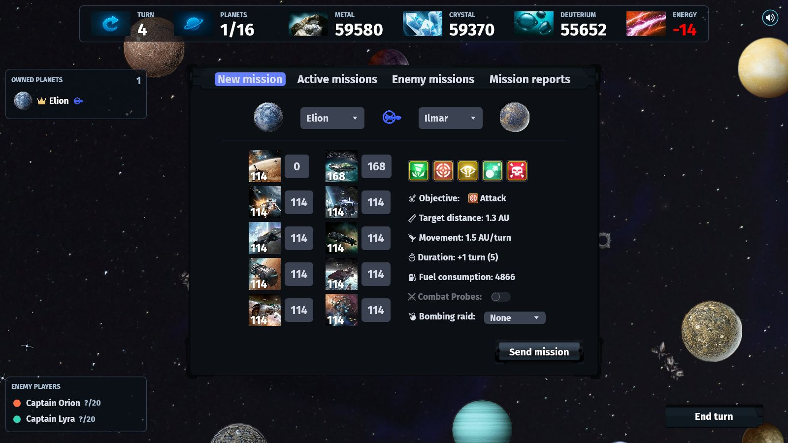
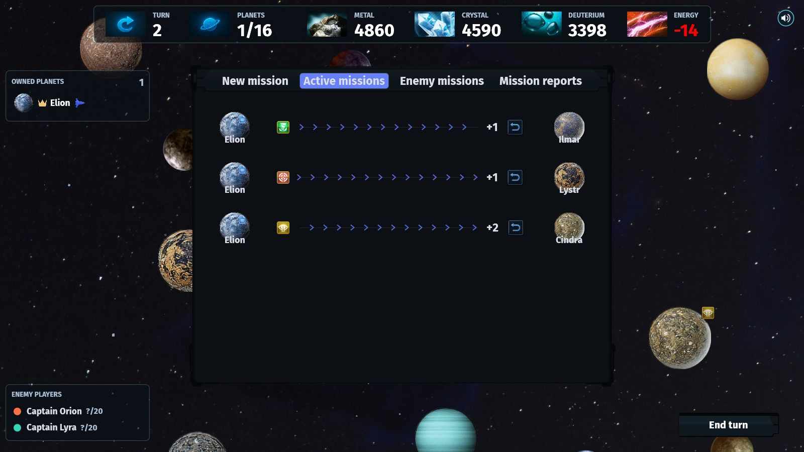
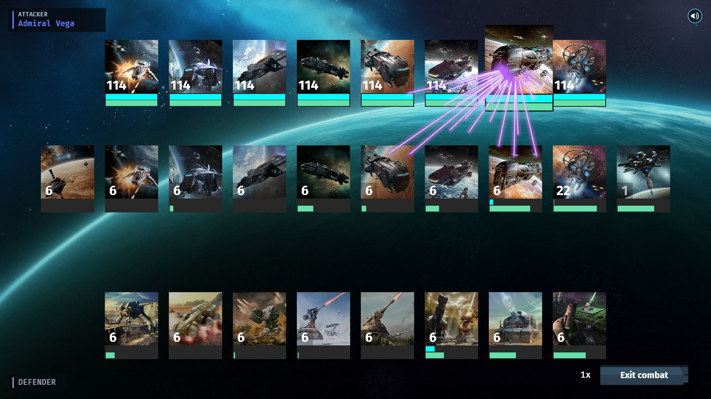

# Stellarion
### A deterministic multiplayer space strategy game for browser and desktop

  

  

 

## 📜 Overview

Stellarion is a turn-based strategy game, where players build interstellar empires. Expand your 
colonies, manage resources, and command fleets that engage in strategic battles for dominance of 
the galaxy. Win by eliminating rival empires or controlling enough of the map. If you lose your
home planet, you are eliminated.

### Win conditions

- **Elimination:** Be the last player who still owns their original home planet. Conquering or
  destroying an opponent's home planet eliminates that player. Mutual elimination is a draw.
- **Territorial control:** Control at least `50% + 50% / n_players` of all non-moon planets.

Victory is checked after all battles and ownership changes for the turn resolve, with no holding
period or countdown. A player who loses their home planet that turn cannot win by territory.
Local Practice has no territorial victory condition.

### Resources

The game presents three resource types:

- **Metal:** Metal is the most basic resource, used in almost all constructions and ships.
- **Crystal:** Crystal is a more advanced resource, essential for high-level buildings and ships.
- **Deuterium:** Deuterium is the least frequent resource in the galaxy, primarily used for 
  high-level ships and as fuel.
- **Energy**: Energy is not a stockpiled resource, but a per-turn capacity. It powers continuously
  operating infrastructure. An energy deficit reduces resource income and Planetary Shield strength.

Planets produce a varying amount of each of these resources. Be aware of your home planet's 
resource production! It should influence the type of strategy you might want to consider for the
game. For example, a home planet with a lack of deuterium forces the player into early expansion 
to be able to fuel its fleet later.

### Planets & Moons

A planet is owned by a player if it's the player's home planet or if it has been colonized by a
Colony Ship. A planet is controlled by a player if the player has military presence on it. If a
planet is owned, it is also controlled by the owner. If a player attacks and wins another planet,
but doesn't colonize it, he gains controls over that planet and the previous owner loses both 
ownership and control.

An owned planet produces resources for its owner. Buildings can only be build and used on owned 
planets. For example, a player controlling (but not owning) a planet, cannot use the Phalanx to 
see incoming attacks nor use the Jump Gate to move its fleet. Combat on an owned planet always 
gives full intelligence on the attacking units to the planet's owner. Also when the fight is lost.
If losing combat on a controlled planet, no intelligence is gained.

There is a limit to the amount of planets that can be owned by a player. Spots are only freed 
if a planet is abandoned, conquered or destroyed. A Senate on the home planet raises this limit
by one planet per level. Galaxy size permits one Senate level per 20 planets, rounded up to a
maximum of three; the 25%, 35%, and 50% ownership settings further cap it at three, two, and one
levels respectively.

Moons cannot be colonized (and thus not owned), but they can be controlled. Contrary to planets, 
players can build on a controlled moon. Moons only have a limited number of fields on which to 
build. Increasing the level of the Lunar Base increases the number of fields. Moons don't have 
defenses.

### Mission types

- **Deploy:** Move a fleet to another planet or moon you control.
- **Colonize:** Send ships including at least one Colony Ship to gain ownership of a planet.
  The Colony Ship is consumed, placing a level-one Metal, Crystal, and Deuterium mine on the
  planet.
- **Attack:** Send combat ships against a hostile world. A victory leaves the fleet there and gives
  control, but not ownership. The previous owner loses both ownership and control. Surviving
  buildings remain.
- **Spy:** Send at least five Probes. Their range begins at one sixth of the galaxy from the origin;
  each completed Command Relay level adds another sixth, with level five reaching every world.
  Unless `combat probes` is enabled, Probes leave after the first combat round. More returning
  Probes reveal better intelligence. Resource buildings are visible at the first intelligence
  tier; the Reactor and Terraformer use tier two; the Shipyard, Factory, and Missile Silo use
  tier three; the Planetary Shield uses tier four; and the Senate and Colonial Administration
  are only visible at tier five. Spy missions
  cannot be detected by a Sensor Phalanx and do not reveal their origin.
- **Missile Strike:** Launch only Interplanetary Missiles against a planet, not a moon. They bypass
  ships and the Planetary Shield to hit defenses directly. Surviving missiles are consumed. A
  strike that is not recalled still hits if the destination later becomes friendly, reveals no
  enemy-unit intelligence, cannot be detected by a Sensor Phalanx, and does not reveal its origin.
- **Destroy:** Attack with combat ships including at least one War Sun. After each round with no
  enemy ships remaining, every War Sun has a size-dependent chance to destroy the planet; the
  chance falls in later rounds. The fleet returns whether destruction succeeds. A destroyed
  planet can never be colonized again.

### Units

You can build four types of units on an owned planet:

- **Buildings:** Buildings are used for varied reasons. Core buildings like the mines, Shipyard,
  Factory, Reactor, Terraformer, Senate, and Colonial Administration support your empire.
  The Terraformer specializes resource production. The Senate belongs on the homeworld;
  Colonial Administration is exclusive to non-home planets and coordinates fleet withdrawal.
- **Orbitals:** Solar Satellites, Sensor Phalanxes, Command Relays, Jump Gates, and Space Docks are
  constructed without Shipyard capacity. One level of each kind may be queued per turn, but
  different kinds may be queued together. Command Relays extend the range of Spy missions launched
  from their planet, while each Jump Gate level supplies its own 5 transport capacity. Orbitals
  cannot be constructed around moons.
- **Ships:** Ships are the backbone of your army. Ship often have unique characteristics that make
  them better or worse suited for certain strategies. Some ships are also stronger or weaker against
  other specific ship types, so try to build your fleet according to your enemy's composition.
- **Defenses:** Defenses are stationary combat units. They have better price-to-stats ratios than
  ships, but are fixed to the planet. Be careful with stacking defenses! War Suns are capable of
  destroying a planet with any defense army. Repair Trucks restore damaged defense turrets after
  each round. Crawlers do not attack; after a defender victory, each survivor recovers 1% of the
  resource cost of destroyed ground defenses, up to 50%. Ships have 80% Rapid Fire against them.
  Missiles are also included with the defense units.

### Energy

Energy is per-turn capacity, not a stockpiled resource. Reactors supply 3 energy per level, while
lunar Tidal Generators supply 5 and Solar Satellite output depends on the solar zone.
Infrastructure that operates continuously creates energy demand; most construction, storage,
transport, and administrative buildings do not draw permanent power. Surplus energy is discarded
and gives no bonus. A shortage scales resource income down with a 25% minimum and reduces Planetary
Shield power with a gentler curve; a fully powered Shield supplies 300 strength per level.
The Terraformer consumes 1 energy per level and the Senate consumes 2. Colonial Administration
consumes no energy.

### Fleet travel

Ships and missiles accelerate throughout each journey. For movement rating `s`, distance covered
after `t` turns is `s * t * (t + 2) / 3` AU. The first turn covers the same distance as before;
each subsequent turn covers an additional `2s/3` AU. Fleets use their slowest unit's rating.
Clicking a fleet on the map opens its active-mission panel. Any owned mission that is not already
returning can be recalled for no additional cost; it reverses from its current position and begins
a new journey back to its original planet.

### Combat

Colonial Administration enables a **Fleet withdrawal** setting in the colony's Buildings shop.
It defaults to Off. Level 1 unlocks withdrawal after 75% fleet losses; levels 2 and 3 add 50%
and 25%; level 4 adds immediate withdrawal. Losses are destroyed ship production points relative
to the starting fleet, checked after each round. Once withdrawal begins, the enemy fires one
additional round while withdrawing ships cannot fire back. Stationary defenses keep fighting.
Level 5 removes the final enemy volley, including a clean departure before any shots when set
to Immediately. Only surviving ships leave; a final volley can destroy the entire withdrawing
fleet. Noncombat Colony Ships accompany the evacuation.

Escaped ships form an ordinary **Deploy** mission to the defender's homeworld, using normal
fleet speed, acceleration, and visibility rules. The mission is dated to the preceding turn
and receives one movement step before the post-battle map: a three-turn voyage has two turns
remaining. A one-turn voyage docks that same turn. The homeworld must still belong to the
defender; homeworlds and moons cannot use Colonial Administration. Retreat does not generate
orbital wreckage, and escaped ships are recorded separately from combat casualties.

In combat, there are two sides: the attacker and the defender. There is the possibility that 
the attacker has launched his fleets against a planet with no defense or ships, in which case 
he automatically wins the combat. But otherwise, if the defender has ships or defense on his 
planet, each side will fire upon the enemy. Combat ends in an attacker victory, a defender
victory, or a draw. If both combat armies survive the 100-round limit, the defender keeps
the planet and the surviving attackers return to their origin.

Every unit (ships + defenses) has four basic parameters that affect combat: hull (H), shield (S), 
damage (D), and rapid fire (RF). Combat consists of rounds. In the beginning of each round, every 
unit starts with its shield at its initial value. The hull has the value of previous round 
(initial value of the ship if it's the first round). In each round, all participating units 
randomly choose a target enemy unit. Shots are resolved per ship type in increasing production
order, i.e., the lowest production units shoots first, and the highest production units shoot last
(ships fire before defenses).

For each shooting unit:

1. If it's the first round of a missile strike, the defender's Antiballistic Missiles will fire
   sequentially until they are depleted or no Interplanetary Missiles remain.
2. A random enemy unit is chosen as target. If the unit is a defense unit and the planet has a 
   Planetary Shield with remaining shield, the Planetary Shield is chosen as target instead.
3. If the damage is lower than the enemy's shield, the shield absorbs the shot, and the unit does 
   not lose hull: S = S - W.
4. Else, if W > S, the shield only absorbs part of the shot and the rest of the damage is dealt to 
   the hull: H = H - (W - S) and S = 0.
5. If the shooting unit has rapid fire against the target unit, it has a chance of RF% of choosing 
   another target at random, and repeating the above steps for that new target.
6. All ships with H=0 (no hull points left) are destroyed.
7. If the objective is to destroy the planet and there are no enemy ships left, each attacking 
   War Sun fires a shot with a chance of 10 - 1 * n_turn to hit. If it hits, the planet is
   immediately destroyed and all defenses and buildings with it.
8. If it's the first round of combat and there are any Probes on the attacker's side, they leave 
   combat and fly back to the origin planet (if `combat probes` option disabled).
9. If every unit of a side (attacker or defender) is destroyed, the battle ends with the opposite 
   side winning.

Things to keep in mind:

- Buildings are build before any combat takes place.
- Missions are resolved in arbitrary player order each turn. This means that you cannot know if
  reinforcements will arrive before or after an attack when they both arrive at the destination
  planet the same turn. If reinforcements arrive after the planet has been conquered, the objective
  automatically is transformed in an attack.
- Attacks on the same planet on the same turn are merged per player and per objective. The planet
  of origin becomes the planet that send the largest army. The order of resolution becomes: Missile
  strikes are resolved first, followed by spying missions, and then the remaining, which are
  grouped together following objective priority `Destroy` > `Colonize` > `Attack`.
- An attacking player receives no enemy unit information if all its units are destroyed. If there
  are scout probes, he can only see the number of enemy units prior to combat.
- A defender player receives no enemy unit information if all its units are destroyed and he
  doesn't own the planet.

 

### Mouse + Key bindings

- `escape`: Enter/exit the in-game menu.
- `enter`: Send mission (when in tab).
- `ctrl + enter`: Finish turn.
- `w-a-s-d`: Move the map.
- `scroll`: Zoom in/out the map.
- `space`: Center the map on your home planet and select it.
- `tab / mouse forward-backward`: Cycle through the shop/mission menu or rounds in a combat report.
- `ctrl + tab`: Cycle through your owned planets (if any selected).
- During combat: `space` pauses, `ctrl + left/right` changes speed, and `ctrl + shift + left/right` jumps rounds.
- `Q`: Toggle the audio settings.
- `C`: Show/hide the player's control domain.
- `I`: Show/hide all planet information.
- `H`: Enable/disable information tooltips on hover.
- `B`: Show/hide the shop panel.
- `M`: Show/hide the mission panel.
